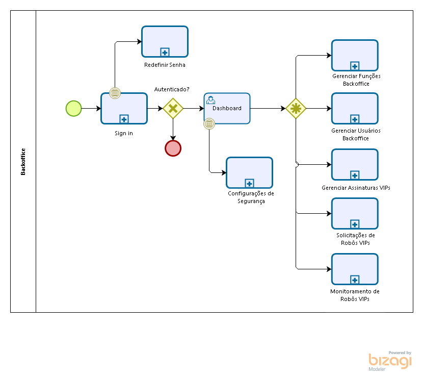

# Desenho do processo

## Ecossistema 24/7 Tradebots

No macroprocesso é possível visualizar todo o ecossistema e seus componentes para atender a Plataforma 24/7 Tradebots.

O ponto focal é o painel gráfico onde os usuários podem interagir com os Trade Bots e acompanhar a performance de seus robôs.

## BackOffice

O processo de BackOffice possui as atividades necessárias para sustentar e gerenciar a Plataforma 24/7 Tradebots.

## **Business components**

### **Account components**

A plataforma está preparada para utilizar provedor de identidade (a principio o Google) para a criação da conta (Sign up) e a autenticação do usuário (Sign in). Também possibilita criar a conta diretamente pela plataforma utilizando um e-mail e preenchendo algumas informações.

A autenticação também verifica se o usuário possui habilitado a Identificação por dois fatores (2FA).

 

### Redefinição de Senha

### Definir plano

Escolher um plano não é obrigatório para a criação da conta 27/7 Tradebots, porém para utilizar os robôs é exigido a definição de um plano de assinatura.

O fluxo do BackOffice é exibido também dentro desse processo.

### Formas de pagamento

O processo de formas de pagamento exibem quais métodos de pagamento vão existir na plataforma.

### Painel Gráfico

O painel gráfico pode ser acessado na área deslogada, o usuário que ainda nem criou a conta pode visualizar o Painel com as funcionalidades limitadas para uso na área deslogada.

### Painel de Operações

Local onde os usuários já logados tem a possibilidade de acompanhar a performance de seus robôs.

### Criação de Robôs

### Robôs Exclusivos

O fluxo do BackOffice é exibido também dentro desse processo

### Relatórios

## Componentes do Usuário

### Meu Perfil

### Configuração da Autenticação de dois fatores (2FA)

### Minha Assinatura

### Minhas Corretoras

## Componentes do BackOffice

### Gerenciar Funções

### Gestão de Usuário

### Monitoramento de Robôs VIPs

